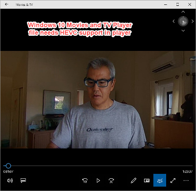
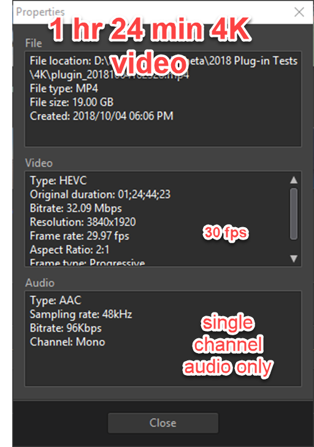
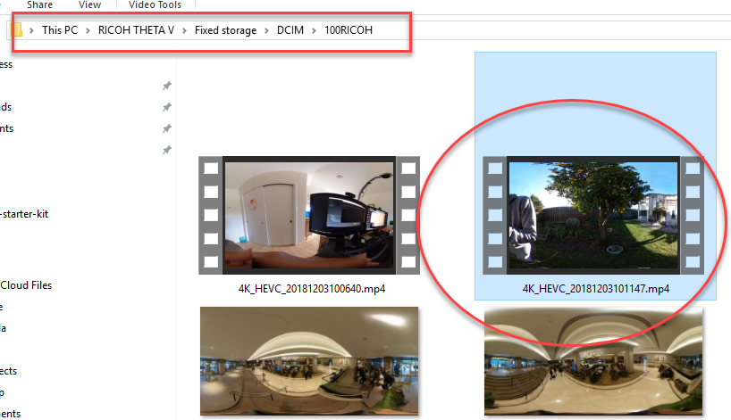
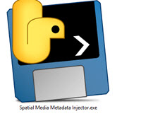
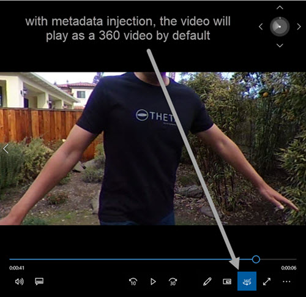
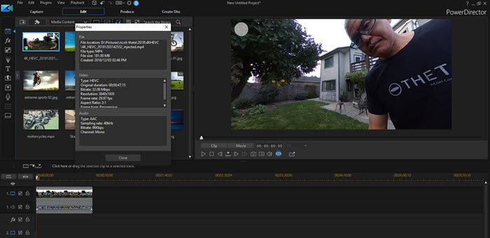
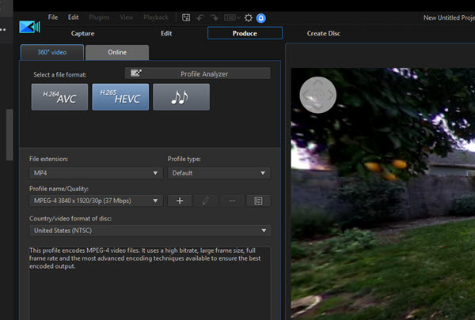
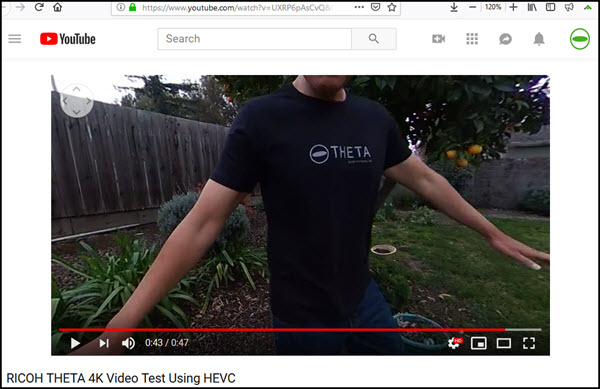
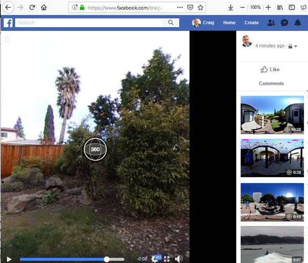
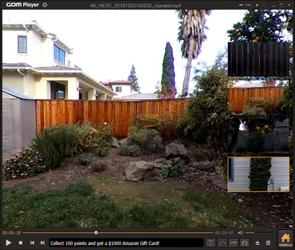

# Long Video High Compression Plug-in for RICOH THETA

Records 4K video with a maximum length of 1 hour 24 minutes. 
It overcomes the 25 minute video limitation of the standard THETA V.

## Benefits

* 336% increase in length of video saved to camera
* 40% reduction in file size - save more videos of shorter length
* 40% faster uploads to YouTube and Facebook

## Installing the Plug-in

Now in the [THETA Store](https://pluginstore.theta360.com/plugins/guide.theta360.long4kvideo/).

## Technical Features

* overcomes 25 minute limit imposed by standard THETA V firmware
* Uses close to full internal storage of THETA V. Set to limit at 19GB per video file.
* Uses High Efficiency Compression, not the default H.264 for video compression
* Reduces bitrate encoding to 32Mbps from 56Mbps, but retains most of the video quality
* Strips out spatial audio file to save on storage space (can be easily added back into code)

## Limitations

* No spatial audio. The code can be modified to save a 4ch spatial audio .wav file with first-order ambisonics B-format. 
The spatial audio file is not saved by default to avoid people having to delete the file.
* Heat. I have not tested this fully, but the camera does seem to get hotter. You may need to blow a fan on the 
outside of the camera body. Or, use it in the winter only. ;-)
* Not all video players support High Efficiency Video Compression. This is a new compression standard and a new frontier.
* metadata is stripped out of the file. You may need to inject the metadata using a tool after your shoot. Instructions are below. 

---

To view the video on Windows 10 Movies and TV Player, you must
add HEVC support to the player.

Both Premiere Pro and CyberLink PowerDirector 17 can handle HEVC.

This plug-in is in the THETA Store. You do not need to compile from source unless you want to modify the code.

If you are are compiling from source, follow these steps for installation:

1. install plug-in with adb
2. set permissions with Vysor
3. use the THETA Desktop app to set the default plug-in "Long 4K Video"

## Usage

1. put camera into plug-in mode
2. take video
3. stop plug-in by pressing lower mode button
4. turn camera off by pressing the power button for 8 seconds
5. turn camera back on and plug into your computer with a USB cable
6. look for the file in /RICOH THETA V/Fixed Storage/DCIM/100RICOH

## For Mac

For larger sized THETA files, use the Mac File Transfer app from Ricoh: https://support.theta360.com/en/download/

Alternatively, use the Image Capture app built into Mac OS. The THETA will appear as a device.

## Post Production

### Spatial Media Metadata Injector

You may need to inject the metadata into the video file
with [Spatial Media Metadata Injector](https://github.com/google/spatial-media/releases).

Install the binary file with the link above. Pre-built applications are available for Mac and Windows.

Open the file.

Save the file with metadata injected with a new filename. Use the new video file
with injected metadata in your applications and on YouTube/Facebook.

### Editing Videos

Both Premiere Pro and PowerDirector support HEVC 360° video editing.

#### Premiere Pro

#### CyberLink PowerDirector 17

You do not need to export to H.265 HEVC. You can export with any encoding.
However, if you want to keep the encoding the same, CyberLink does support
HEVC format output, which will give you a smaller file size than H.264.

## Sharing HEVC-encoded 360° Videos on Social Media

After injecting the metadata, you can upload the HEVC file directly to YouTube and YouTube. 
With the metadata, it will automatically be detected as a 360° video.

### YouTube

https://youtu.be/UXRP6pAsCvQ

### Facebook

## Other Video Players

GOM Player works with 360° navigation.

---

* VLC 3.0.4 did not display the video properly
* DiVX media player did not provide 360° navigation

